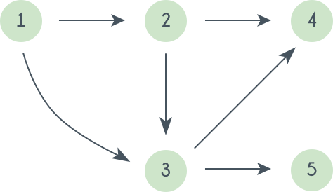
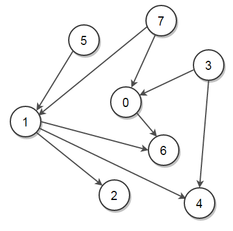

# Topological Sort

---

#### Definition

Topological sorting of vertices of a *Directed Acyclic Graph* 
is an ordering of the vertices *V1, V2,... Vn* in such a way, 
that if there is an edge directed towards vertex *Vj* from 
vertex *Vi*, then *Vi* comes before *Vj*. 

---

#### Topological Sort - Example

Consider the _DAG_ given below:

 
Some topological sorts of this graph are:
 
    (1 2 3 4 5), (1 2 3 5 4)
 
 
---

#### Topological Sort - Find them!

So, basically, we want to find a permutation of the 
vertices in which:

> For every vertex *Vi*, having edges coming out and 
directed towards *Vj*, *Vi* comes before *Vj*. 

---

#### Topological Sort - Exercise!

Solution:
    
    [7, 5, 1, 2, 3, 4, 0, 6]

---
 
### Resources

- [HackerEarth, Topological Sort](https://www.hackerearth.com/practice/algorithms/graphs/topological-sort/tutorial/)
- [Wikipedia, Topological_sorting](https://en.wikipedia.org/wiki/Topological_sorting)
- Laakmann McDowell, Gayle; Crack the Code Interview.
